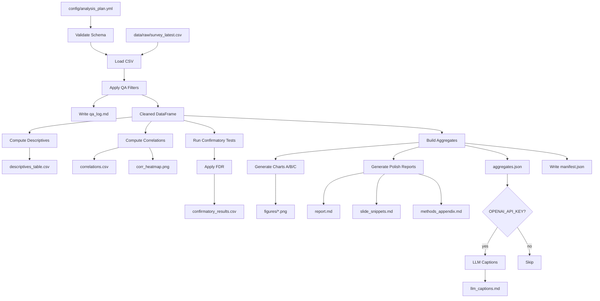

# PRD: Likert Survey Analysis Pipeline (Canonical)

> **Source of truth**: This file (`docs/PRD.md`) is the canonical PRD. Implementation must follow this document.  
> Older planning iterations are archived in `docs/archive/` for historical reference only.

---

## 1. Overview

A minimal, prereg-safe Python pipeline for same-day analysis of a Likert-scale survey ("Budget priorities and security"). The pipeline produces presentation-ready outputs in Polish while maintaining strict research integrity controls.

### Goals

- Produce 3 showcase charts (A/B/C) with slide-ready Polish narratives
- Support two personas (campaign vs Ministry of Finance) via text-only switching
- Eliminate researcher degrees of freedom through locked configuration
- Generate exhaustive exploratory outputs to prevent cherry-picking
- Ensure full reproducibility via manifest and config hashing

### Non-Goals (Out of Scope)

- Exploratory Factor Analysis (EFA) — excluded to reduce complexity
- Causal inference claims
- Polychoric correlations (Spearman only for simplicity)

---

## 2. Language Policy

| Context | Language |
|---------|----------|
| Code, variable names, comments | English |
| Developer docs (README, CLAUDE.md, docstrings) | English |
| Analysis outputs (report.md, methods_appendix.md, slide_snippets.md, chart titles/labels) | **Polish** |

---

## 3. Research Integrity & Degrees-of-Freedom Controls

### 3.1 Locked Analysis Plan

All analytical decisions are pre-specified in `config/analysis_plan.yml`:

- **No data-driven item selection**: `items_universe` is the ONLY selector of Likert items
- **No heuristic discovery**: QA filters (age, attention check) are explicitly configured
- **No post-hoc indices**: indices must be defined before running the pipeline
- **Immutable config**: changing `analysis_plan.yml` changes `analysis_plan_hash` in manifest

### 3.2 Confirmatory vs Exploratory Separation

- `outputs/report.md` has hard-split sections: `## Wyniki konfirmacyjne` and `## Wyniki eksploracyjne`
- Confirmatory tests are explicitly listed in `confirmatory_tests` config
- Exploratory outputs are exhaustive and always generated (no toggle)

### 3.3 Multiple Comparisons Correction

- For any family with >1 confirmatory test: apply Benjamini–Hochberg FDR at q=0.05
- Report both raw `p` and adjusted `p_adj` in `confirmatory_results.csv`
- Number of tests per family is explicit in config

### 3.4 Persona Invariance

- Personas (`campaign` | `minfin`) only change narrative text
- `aggregates.json` must be **byte-identical** across persona runs
- Automated test enforces this invariance

---

## 4. Item Universe (Locked)

### 4.1 Definition

`items_universe` is an explicit list of **exact CSV column headers** for all Likert items to be analyzed.

### 4.2 Rules

- The pipeline computes descriptives, correlations, and plots **only** over columns in `items_universe` (plus derived indices, if any)
- Any CSV column **not** in `items_universe` is treated as metadata and excluded from statistical outputs
- **Fail-fast**: if any column listed in `items_universe` is missing from the CSV, the pipeline exits immediately with a clear error message
- Changing `items_universe` changes `analysis_plan_hash` in manifest

### 4.3 Item Labels (Optional)

- `item_labels` provides short display names for charts/tables (Polish)
- **Does NOT affect item selection** — purely for display
- Keys must be a subset of `items_universe` entries

---

## 5. Repo Structure

```
/
├── config/
│   └── analysis_plan.yml       # Locked analysis configuration
├── data/
│   ├── raw/
│   │   └── survey_latest.csv   # Input data (Google Forms export)
│   └── processed/              # Cleaned data (parquet)
├── docs/
│   ├── PRD.md                  # This file (canonical)
│   └── archive/                # Historical planning docs
├── outputs/
│   ├── figures/                # PNG charts
│   └── (generated files)       # Reports, tables, manifest
├── scripts/
│   └── run_pipeline.py         # CLI entrypoint
├── src/
│   ├── __init__.py
│   ├── schema.py               # Pydantic config validation
│   ├── loader.py               # CSV loading + QA filters
│   ├── analysis.py             # Descriptives, correlations, tests
│   └── outputs.py              # Report/chart generation
├── tests/
│   └── (pytest tests)
├── CLAUDE.md                   # Agent working rules
├── README.md                   # How to run (3 commands)
├── .env.example                # Environment template
└── pyproject.toml              # uv/Python dependencies
```

---

## 6. Config Spec: `analysis_plan.yml`

```yaml
version: "1.0"

# --- ITEM UNIVERSE (LOCKED, REQUIRED) ---
# Exact CSV column headers for all Likert items.
# Pipeline fails fast if any column is missing.
items_universe:
  - "1. Obecna sytuacja bezpieczeństwa w regionie zwiększa ryzyko zagrożenia militarnego dla Polski."
  - "2. W najbliższych latach Polska powinna zwiększyć wydatki na obronność."
  - "3. Nawet kosztem innych wydatków publicznych obronność powinna być jednym z priorytetów budżetu państwa."
  # ... (all 26 Likert items with exact CSV headers)
  # NOTE: Item 13 (attention check) excluded. Demographics are metadata.

# --- ITEM LABELS (OPTIONAL, DISPLAY ONLY) ---
item_labels:
  "1. Obecna sytuacja...": "Ryzyko militarne"
  # ...

# --- QA FILTERS (REQUIRED, EXPLICIT) ---
qa_filters:
  age_column: "Czy masz ukończone 18 lat?"
  age_keep_value: "Tak"
  attention_check_column: "13. To pytanie ma charakter techniczny..."
  attention_check_expected: "Raczej się zgadzam"

# --- INDICES (may be empty) ---
indices: []
# OR:
# indices:
#   - id: mandate_defense
#     label_pl: "Mandat dla obronności"
#     direction_label_pl: "wyższe = silniejszy mandat"
#     items: [...]              # must be in items_universe
#     reverse_items: []         # explicit list; no inference
#     score_method: mean        # mean | median
#     min_valid_items: 1

# --- CORRELATIONS ---
correlations:
  scope: all_items              # all_items | indices_only | indices_and_items
  items_explicit: []            # only if scope = indices_and_items

# --- CONFIRMATORY TESTS (may be empty) ---
confirmatory_tests: []
# OR:
# confirmatory_tests:
#   - id: H1
#     dv: mandate_defense
#     iv_grouping: null         # null = descriptive only
#     test_type: descriptive    # descriptive | mann_whitney | kruskal_wallis
#     family: confirmatory

# --- GATING THRESHOLDS ---
gating_thresholds:
  min_group_n: 10               # skip group test if any group < this

# --- MISSINGNESS RULES ---
missingness_rules:
  flag_threshold: 0.20          # flag in qa_log if item missingness exceeds this (do NOT drop)
  index_na_rule: min_valid_items  # index = NA if respondent has fewer valid items

# --- FDR SETTINGS ---
fdr_settings:
  q: 0.05
  method: bh                    # bh | bonferroni | holm

# --- CHARTS ---
charts:
  - id: A_mandate_vs_financing
    type: diverging_bar
    items: [...]                # must be in items_universe
  - id: B_acceptable_cuts
    type: stacked_bar
    items: [...]
  - id: C_inflation_drivers
    type: grouped_bar
    items: [...]

# --- PERSONA TEXTS ---
persona_texts:
  campaign:
    report_intro: "Raport dla sztabu wyborczego..."
    slide_cta: "Rekomendacja: podkreślić mandat społeczny..."
  minfin:
    report_intro: "Raport dla Ministerstwa Finansów..."
    slide_cta: "Rekomendacja: uwzględnić ostrożność fiskalną..."
```

### Validation Rules (Fail-Fast)

| Field | Rule |
|-------|------|
| `items_universe` | Non-empty list; each string must exactly match a CSV column header |
| `item_labels` | Optional; if present, keys must be subset of `items_universe` |
| `qa_filters` | All four fields required; columns must exist in CSV |
| `indices` | May be empty; if non-empty, each index needs ≥1 item from `items_universe` |
| `indices[].reverse_items` | Must be explicit list (no inference from item text) |
| `correlations.scope` | Must be: `all_items`, `indices_only`, or `indices_and_items` |
| `correlations.items_explicit` | Required and non-empty if scope = `indices_and_items` |
| `confirmatory_tests` | May be empty |
| `gating_thresholds` | `min_group_n` required with positive value |
| `missingness_rules` | `flag_threshold` in [0,1]; `index_na_rule` = `min_valid_items` |
| `fdr_settings.method` | Must be: `bh`, `bonferroni`, or `holm` |
| `charts` | Non-empty; IDs must match `A_*`, `B_*`, `C_*`; items must be in `items_universe` |

---

## 7. Mandatory Outputs

| File | Always | Description |
|------|--------|-------------|
| `outputs/descriptives_table.csv` | Yes | Columns: `item_id`, `n`, `missing_pct`, `median`, `mode`, `pct_1`..`pct_5`, `flagged_missingness` |
| `outputs/qa_log.md` | Yes | Sections: items_universe count+list, ignored columns, QA filter counts (18+, attention), missingness flags |
| `outputs/correlations.csv` | Yes | Spearman correlation matrix per `correlations.scope` |
| `outputs/figures/corr_heatmap.png` | Yes | Heatmap of correlation matrix |
| `outputs/confirmatory_results.csv` | Yes | Columns: `test_id`, `dv`, `iv`, `statistic`, `p`, `p_adj`, `effect_size`, `n`, `note`. If no tests: header + note row |
| `outputs/report.md` | Yes | Polish; sections: `## Wyniki konfirmacyjne`, `## Wyniki eksploracyjne` |
| `outputs/methods_appendix.md` | Yes | Polish; sections: Item Universe, Scoring Rules (reverse-coding 6-x, direction labels), Missingness, FDR, Limitations |
| `outputs/slide_snippets.md` | Yes | Polish; 3 blocks per chart: title + 2 insights + 1 limitation |
| `outputs/figures/A_*.png` | Yes | Chart A (mandate vs financing) |
| `outputs/figures/B_*.png` | Yes | Chart B (acceptable cuts) |
| `outputs/figures/C_*.png` | Yes | Chart C (inflation drivers) |
| `outputs/aggregates.json` | Yes | Aggregates only (no row-level data, no timestamps, no free text) |
| `outputs/manifest.json` | Yes | Keys: `input_hash`, `analysis_plan_hash`, `python_version`, `library_versions`, `timestamp_utc`, `persona` |
| `outputs/llm_captions.md` | Optional | Only if `OPENAI_API_KEY` set; max 60 words/chart; reads aggregates.json only |

---

## 8. Acceptance Criteria (Machine-Verifiable)

| # | Criterion | How to Test |
|---|-----------|-------------|
| 1 | `analysis_plan.yml` passes schema validation | `uv run python -c "from src.schema import validate; validate()"` exits 0 |
| 2 | Pipeline exits 0 with valid config | `uv run python scripts/run_pipeline.py` exits 0 |
| 3 | Pipeline runs with `indices: []` | Pipeline still exits 0; generates all mandatory outputs |
| 4 | Invalid `correlations.scope` fails | Set `scope: invalid`; pipeline errors with clear message |
| 5 | `confirmatory_results.csv` always exists | File exists; if no tests, contains header + note row |
| 6 | FDR applied for >1 confirmatory test | `p_adj` column present; values ≤ 1 |
| 7 | Exhaustive outputs generated | All mandatory files exist and non-empty |
| 8 | Manifest complete | JSON has all 6 required keys |
| 9 | Report has conf/expl split | Contains `## Wyniki konfirmacyjne` and `## Wyniki eksploracyjne` |
| 10 | Persona invariance | `aggregates.json` byte-identical for `--persona campaign` vs `--persona minfin` |
| 11 | Persona changes text | `slide_snippets.md` differs between personas |
| 12 | Missingness flagged | Items with `missing_pct > flag_threshold` have `flagged_missingness = True` |
| 13 | Reverse-coding logged | `methods_appendix.md` contains formula and direction labels |
| 14 | Tests pass | `uv run pytest -q` exits 0 (≥4 tests) |
| 15 | `items_universe` validated | Missing column → fail-fast with clear error |
| 16 | Extra columns ignored | Dummy column not in `descriptives_table.csv` or `correlations.csv` |
| 17 | Exact item count | Row count in `descriptives_table.csv` = `len(items_universe)` |
| 18 | QA log complete | Contains "items_universe" section with count and list |
| 19 | QA filters applied | `qa_log.md` shows counts for age + attention check filtering |
| 20 | LLM optional | Without `OPENAI_API_KEY`: pipeline exits 0; `llm_captions.md` absent or has "SKIPPED" |

---

## 9. Tooling

- **Python**: 3.11+
- **Package manager**: uv (fast, single-file lock)
- **Core dependencies**: pandas, numpy, scipy, matplotlib
- **Optional**: pingouin (reliability/effect sizes), openai (LLM captions)

---

## 10. Pipeline Flow



---

## 11. Implementation Plan

| Step | Description | Commit |
|------|-------------|--------|
| 1 | Populate `config/analysis_plan.yml` with real items_universe | `chore: populate analysis_plan with items_universe` |
| 2 | Implement `src/schema.py` with Pydantic validation | `feat: schema validation with fail-fast` |
| 3 | Implement `src/loader.py` with QA filters | `feat: CSV loader + QA filters` |
| 4 | Implement `src/analysis.py` (descriptives, correlations, tests, FDR) | `feat: analysis module` |
| 5 | Implement `src/outputs.py` (reports, charts, manifest) | `feat: output generation` |
| 6 | Implement `scripts/run_pipeline.py` CLI | `feat: pipeline CLI` |
| 7 | Add tests | `test: schema, outputs, persona invariance` |
| 8 | Optional: LLM captions module | `feat: optional LLM captions` |
| 9 | Final validation | `chore: final smoke test` |

---

## 12. Risk Mitigations

| Risk | Mitigation |
|------|------------|
| Selective reporting (p-hacking) | Locked config + exhaustive exploratory tables |
| Cherry-picking charts | Chart list in config; only those generated |
| Ad-hoc index creation | Indices must be in config; post-hoc labelled as exploratory |
| Narrative spin | Persona only changes text; aggregates.json identical; automated test |
| Treating ordinal as interval | Explicit warning in methods_appendix; medians primary; means labelled as approximation |
| Small group sizes | `min_group_n` threshold; tests skipped with note |
| LLM hallucination | Aggregates-only input; max 60 words; outputs labelled |

---

## 13. References

- **FDR/BH**: Benjamini & Hochberg (1995); statsmodels `multipletests`
- **Likert best practices**: PMC3886444 (medians + nonparametric); Statistics By Jim
- **Effect sizes**: epsilon-squared `H/(N-1)` for Kruskal-Wallis; rank-biserial for Mann-Whitney
