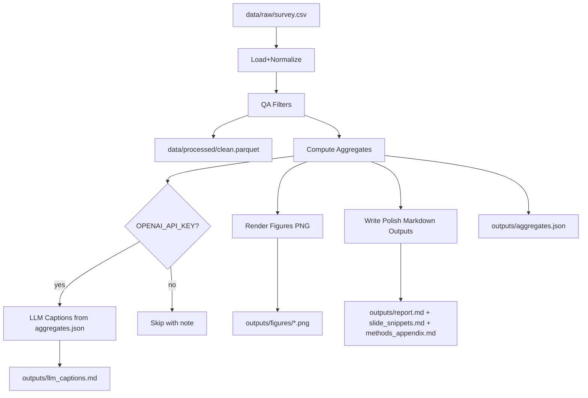

# PRD + Minimal Repo Scaffold for Same‑Day Likert Survey Analysis

## Context & constraints (fixed)

- **Data**: single Google Forms CSV in repo root: `Ankieta_ Priorytety budżetowe i bezpieczeństwo.csv`.
- **Outputs language**: all analysis deliverables (charts/titles/labels + `outputs/*.md`) **in Polish**.
- **Developer docs/code**: **in English**.
- **Likert/ordinal stance**: treat items as **ordinal**; any means/SD use must be explicitly framed as a pragmatic approximation.
- **LLM**: only summarise **aggregates** (never raw rows), only if `OPENAI_API_KEY` exists; otherwise skip gracefully.
- **Goal**: “5‑minute showcase” with 3 findings (A/B/C) + slide-ready snippets; support two personas (campaign vs Ministry of Finance) by switching narrative text **without changing code**.

## Data discovery (from quick inspection)

- CSV is **valid but has multiline quoted headers** (question text spans multiple physical lines). Loader must support this reliably.
- Mixed response formats:
  - Agreement scale: e.g., “Zdecydowanie/Raczej się zgadzam”, “Ani tak, ani nie”, “Raczej/Zdecydowanie się nie zgadzam”.
  - Intensity scale: “Wcale” → “W bardzo dużym stopniu”.
  - Numeric 1–5 responses for “acceptable cuts” items.
  - Categorical preference item for financing method (tax vs debt vs depends).
- Deterministic QA columns exist:
  - **18+ filter**: “Czy masz ukończone 18 lat?” (keep “Tak”).
  - **Attention check**: item text instructs selecting “Raczej się zgadzam” (pass criterion).

## Repo structure to create

- `/data/raw/` (copy of CSV; keep original untouched)
- `/data/processed/` (cleaned parquet + QA logs)
- `/src/` (Python package)
- `/scripts/` (entrypoints)
- `/docs/PRD.md`
- `/outputs/` (generated artifacts)
- `CLAUDE.md`, `active_context.md`, `REUSE_NOTES.md`, `README.md`, `.env.example`, `pyproject.toml`

## Tooling choice

- **uv** for dependency management (fast, low friction, single command execution via `uv run`).
- Python **3.11+**.

## Pipeline design (minimal but robust)

### Key implementation decisions

- **Robust CSV read**: use pandas `read_csv` with settings that tolerate multiline quoted headers; treat all raw cells as strings initially, then map.
- **Stable column IDs**: derive short, stable IDs (e.g., `q02_increase_defense`, `cuts_culture`, `demo_gender`) to avoid huge Polish column names in code.
- **Mappings**:
  - Agreement → ordered ints 1–5.
  - Degree scale (Wcale…W bardzo dużym) → ordered ints 1–5.
  - Numeric 1–5 (cuts) parsed as ints (document assumed direction if anchors absent).
  - Financing preference kept categorical (3–4 levels).
- **Missingness**: produce per-item missingness table and overall missingness rate; document handling (pairwise vs listwise) per analysis.
- **Indices (2–4)**: build only where conceptually coherent after mapping; each index stores item list + direction (reverse-coded flags).
  - Always compute **Cronbach’s alpha** (implemented locally; no hard dependency).
  - Compute **McDonald’s omega** if an optional dependency is available (use `reliabiliPy` or a one-factor model via `factor_analyzer`); otherwise note “not computed”.
- **Group comparisons (optional)**: gender + age group by default, if group sizes are adequate; use Mann–Whitney (2 groups) / Kruskal–Wallis (k>2) + effect sizes (rank-biserial / epsilon-squared). Skip with an explicit note if assumptions/data size inadequate.
- **Mini‑EFA (future work gate)**: run only if `N >= 150` and there is a coherent item block (≥10 items, acceptable missingness). Otherwise mark “out of scope” in `outputs/methods_appendix.md`.

## Showcase findings & required charts (A/B/C)

- **A: Mandate for defense vs dislike of financing methods**
  - Inputs: defense mandate items (e.g., “increase defense spending / priority”) vs financing acceptability (tax increase, public debt) + financing preference.
  - Output: `outputs/figures/A_mandate_vs_financing.png` + 1–2 sentence takeaway (PL).
- **B: Acceptable cuts**
  - Inputs: cuts acceptability items (culture, admin, investments, transfers).
  - Output: `outputs/figures/B_acceptable_cuts.png` + takeaway (PL).
- **C: Inflation narrative (sources) and/or transfers vs taxes**
  - Inputs: inflation cause degree items (external vs firms vs transfers) and/or immediate transfers vs tax reductions.
  - Output: `outputs/figures/C_inflation_drivers_or_transfers.png` + takeaway (PL).

## Required generated artifacts (outputs)

- `outputs/figures/*.png` (minimum 3, named A/B/C)
- `outputs/report.md` (≈1 A4 page, Polish)
- `outputs/slide_snippets.md` (3 blocks: slide title + 2 insights + 1 limitation, Polish)
- `outputs/methods_appendix.md` (methods + limitations + formulas, Polish)
- `outputs/aggregates.json` (aggregates only)
- `outputs/llm_captions.md` (only when API key exists; aggregates-only prompt; Polish)

## Persona switching (no code changes)

- CLI flag `--persona campaign|minfin`.
- Persona affects only:
  - chart subtitles / report framing / slide snippet language
  - “what to do next” recommendations
- Numbers and aggregates remain identical.

## Acceptance criteria (machine-verifiable)

- **Repo artifacts** exist and non-empty:
  - `docs/PRD.md`, `CLAUDE.md`, `active_context.md`, `REUSE_NOTES.md`, `.env.example`, `README.md`, `pyproject.toml`.
- **Running the pipeline**:
  - `uv sync` then `uv run python scripts/run_pipeline.py --input data/raw/survey.csv --persona campaign` exits **0**.
  - Creates non-empty: `outputs/report.md`, `outputs/slide_snippets.md`, `outputs/methods_appendix.md`, `outputs/aggregates.json`.
  - Creates ≥3 PNGs in `outputs/figures/` with names starting `A_`, `B_`, `C_`.
- **LLM optionality**:
  - With `OPENAI_API_KEY` unset: pipeline still exits 0; report mentions captions skipped; `outputs/llm_captions.md` is absent or contains a clear “SKIPPED” marker.
  - With `OPENAI_API_KEY` set: `outputs/llm_captions.md` exists and contains ≤60 words per chart, Polish.
- **Aggregates-only guarantee**:
  - `outputs/aggregates.json` contains only counts/percentages/summary stats—no respondent-level rows, timestamps, or free text.
- **Testing**:
  - `uv run pytest -q` passes; at least one smoke test asserts outputs are generated.
- **Persona switch**:
  - Running pipeline twice with different personas produces different narrative text in `outputs/slide_snippets.md` while `outputs/aggregates.json` is byte-identical.

## Git usage plan (small commits)

- Commit 1: repo scaffold + uv/pyproject + README skeleton
- Commit 2: docs (`PRD.md`, `CLAUDE.md`, `active_context.md`, `REUSE_NOTES.md`, `.env.example`)
- Commit 3: pipeline core (load/QA/mapping/aggregates)
- Commit 4: charts + Polish report/snippets/appendix
- Commit 5: optional LLM captions module
- Commit 6: tests + validation script (if added)

## Execution steps (what I will do after you approve this plan)

1. Initialize git, create target folders, copy CSV into `data/raw/survey.csv` (keep original file untouched).
2. Create required docs files and keep `active_context.md` updated after each step.
3. Add `pyproject.toml` (uv) + minimal dependencies; implement pipeline modules under `src/` and entrypoint under `scripts/`.
4. Generate A/B/C charts + Polish Markdown outputs + aggregates.json.
5. Add optional OpenAI captions module reading only `outputs/aggregates.json`.
6. Add smoke tests and ensure acceptance criteria are satisfied.
7. Make the small git commits listed above.